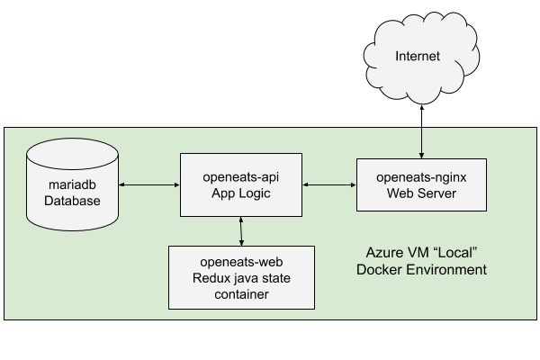
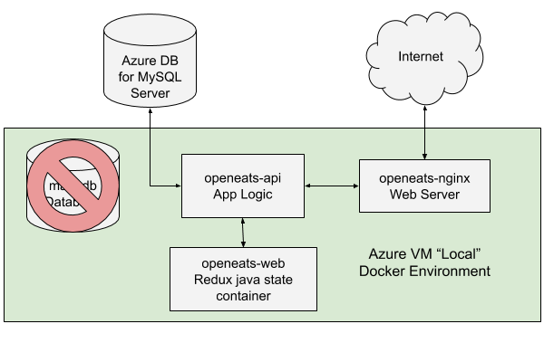
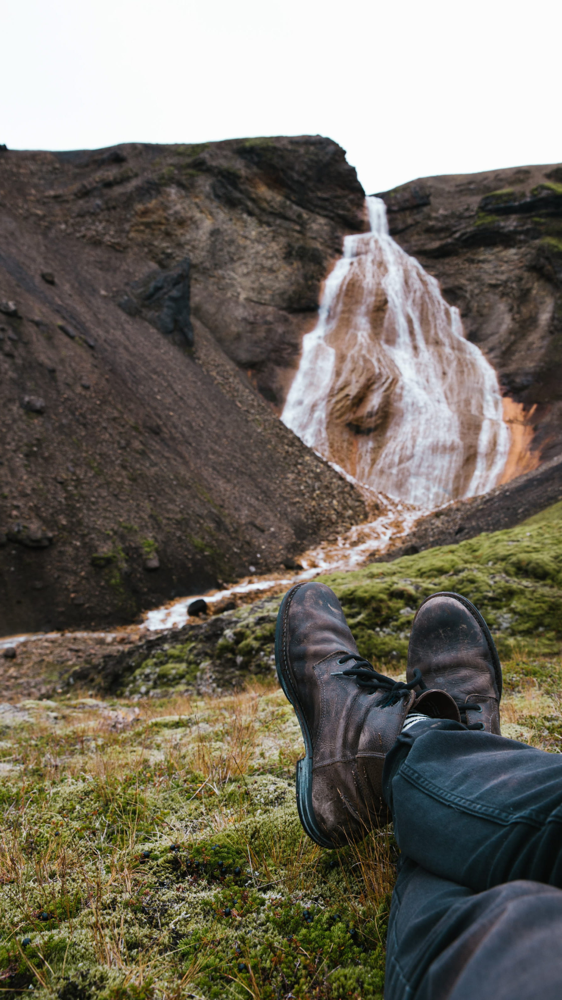

<a id="top"></a>
# TCMG303 Practicum Final: Gotta Run!


# Dear SysAdmin:

Gordon Ramsay met with our company owners yesterday and dropped a bomb (along with a few f-bombs). He wants us to create a new site for him THIS WEEKEND. To make matters worse, he heard about this neat thing called "open source software" and thinks it would be really lit to use it. You may be aware that Mr. Ramsay can be a bit temperamental and demanding, so we have one shot to get this right.

## Mission
> Your task is to create and deploy a functional Web app in Azure Cloud Services using the [open source project OpenEats](https://github.com/open-eats/OpenEats/).

## Requirements
Summarizing Mr. Ramsay's requirements, the application must be:

* Based upon the Open Eats project located at https://github.com/open-eats/OpenEats
* Built using Docker and Docker Compose tools according to the OpenEats documentation
* Served over port 80 (acceptable) or 443 (better). 
* Populated with example data according to the OpenEats documentation 
* Populated with at least one additional news banner to be configured from the within the app and welcoming Mr. Ramsay to the site (a pic would be nice!)
* Connected to a persistent Azure for MySQL Database Server. This database must also have the example data and a second news banner welcoming Mr. Ramsay to the site.

# Background

Looking over the project, the app is deployed using four containers with the following functions:

1. [openeats/openeats-nginx](https://github.com/open-eats/openeats-nginx) - This is a customized nginx web server that acts as a [reverse proxy](https://www.nginx.com/resources/glossary/reverse-proxy-server/). This container serves as the web front-end for the app but doesn't contain any data or website templates.
2. [openeats/openeats-api](https://github.com/open-eats/openeats-api) - This is the core app that contains all of the website logic and templates. It's built on the [Django](https://www.djangoproject.com/) web framework.
3. [openeats/openeats-web](https://github.com/open-eats/openeats-web) - This is a customized state container for the app based upon [React and Redux](https://react-redux.js.org/). A state container is responsible for "bundling" the data and serving it as javascript to the front-end. This particular container is an intermediate and doesn't continue to run after the app is built, although it's necessary.
4. [mariadb](https://hub.docker.com/_/mariadb) - This is an unmodified containerized database common in many microservice apps. Mariadb is a lightweight version of MySQL and acts almost identically. While running mariadb as a container is good for testing, a production app should use persistent external storage.

# Suggestions for Deployment
I've looked over the OpenEats repo and have a few suggestions that may help you in the deployment:

## Develop the solution in two stages:

### Phase 1 Model: Deploy the OpenEats app "locally" on a fresh Azure VM using the Docker method according to the documentation. Here is a diagram of how the app functions:


### Phase 2 Model: Create a persistent database service using Azure Database for MySQL Server, and then connect the local app to it. Here is a diagram of how the app functions:


## Advice from your sensei

* My #1 suggestion is `READ THE DOCS!!!!` Don't start madly typing and deploying. Become familiar with where things are and how things work BEFORE you jump in. What you need to know is *mostly* there.

* Don't be "that guy" - you know - the one who blasts out a message to everyone when he hits the first bump. It really hurts the team's performance, demonstrates that you're not willing to solve your own problem, alienates you from the team, and will hurt your career in the long run. If you run into a tough problem, do your homework, try to solve it, and only then involve your team.


# Getting Started

For your development VM, use Azure Standard E2s v3 (2 vcpus, 16 GiB memory). Name it `OpenEatsDocker` and create it in the `South Central US Region`.

Clone the repos `in your home directory`:
```
~$ git clone https://github.com/adaptiman/tcmg303final.git  
~$ git clone https://github.com/open-eats/OpenEats.git 
```

# Checking your Work

Luke has written a little program for you contained in this repo that will check your deployment as you go. Run it occasionally and check your work:
```
$ ~/tcmg303final/final_grader
```
### Points for the test are assigned as follows:

```
Phase 1:
       OpenEatsDocker hostname  +10  
                        docker  +10  
                docker-compose  +10  
          Azure authentication  +20  
 App running on any port (1/3)  +40  
  App running on port 80 (2/3)  +40  
 App running on port 443 (3/3)  +60  
                     Test data  +40  
               2nd news banner  +30  
Phase 2:
          App status (phase 2)  +40  
             External database  +80  
                Data installed  +20  
```
# Extra Credit

One thing I didn't get around to prepping for you was migrating the local docker containers to Azure App Services - `worth 100 points of extra credit` if you can do it. I tried for two days to get it to work and was not successful - this is tough nut because the App Service documentation is a little thin. I would concentrate on the methodology for passing environment variables to an App Service. There are several ways to do it.

Note that this tasks is NOT evaluated by the grader program, so you'll have to contact me via Slack or Discord prior to Monday at noon to get credit. To get full credit, you will need to document the steps you took to accomplish it.

# Final Note

Unfortunately, my vacation starts today, so I won't be here this weekend to help you. Since I'm hiking in the Dolomites, my mobile reception will probably be spotty. I might be able to respond on Discord or Slack, but you never know. Well, I'm off. In case I don't see you for a while, have a good summer, and GOOD LUCK!

